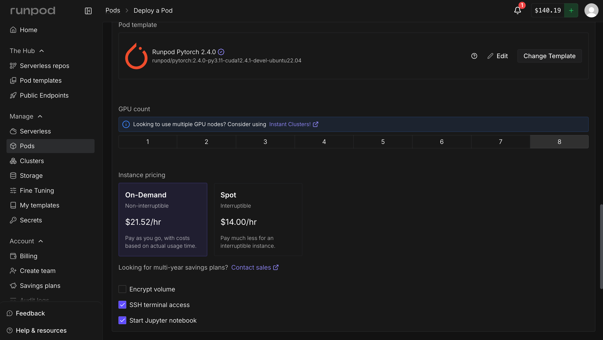
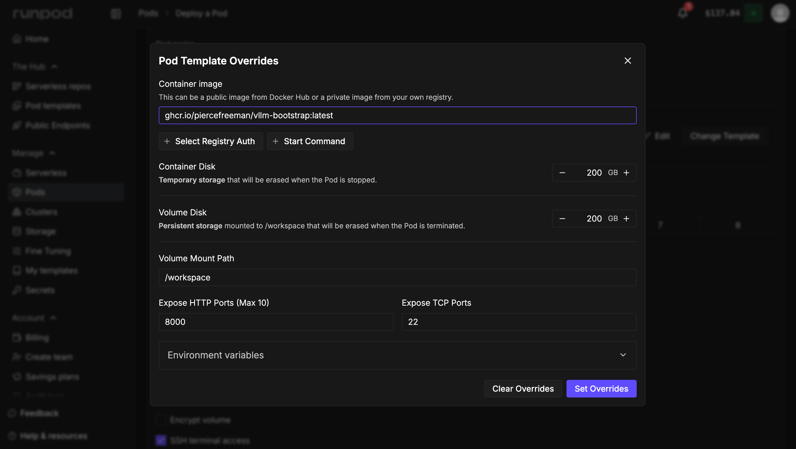

# RunPod Quick Guide

## 1. Create the pod
1. Go to `RunPod -> Pods -> Deploy a Pod`.
2. Pick the `Runpod Pytorch 2.4.0` template.
3. Choose your GPU count and instance type.
4. Keep `SSH terminal access` enabled.



## 2. Override the container image
1. Click `Edit` in the pod template section.
2. Set `Container image` to `ghcr.io/piercefreeman/vllm-bootstrap:cuda12.4-latest`.
   This tag is aligned with the default `runpod/pytorch:2.4.0-py3.11-cuda12.4.1-devel-ubuntu22.04` template.
3. Change `Expose TCP Ports` from `22` to `22, 8001`. RunPod's HTTP proxy only supports HTTP/1.1, but gRPC requires HTTP/2 end-to-end. Exposing port 8001 as a direct TCP port bypasses the proxy so gRPC connections work.
4. Change `Expose HTTP Ports` from `8888` to `8000` if you want to leverage the runpod public proxy service. If you do this, you should make sure to add a `VLLM_ACCESS_KEY` env param that will protect your vllm service. Don't give away that compute for free, you know?
5. Click `Set Overrides`, then deploy.



## 3. Verify the server is up
If everything worked:
1. Click into the running pod.
2. Go to `HTTP Services`.
3. Click the `:8000` service to open the `vllm-bootstrap` home health screen (`/`).

You can also open `http://<your-runpod-endpoint>:8000/docs` for API docs.

## 4. Connect the client

The REST control plane is available through RunPod's HTTP proxy, but gRPC needs the direct TCP address. Find the gRPC address in the pod's `Connect` dialog under `Direct TCP ports` — it will show something like `<ip>:<mapped-port>` for port 8001.

Pass that as `grpc_address` (bare `host:port`, no `http://` prefix — gRPC is not HTTP/1.1):

```python
from vllm_bootstrap_client import VLLMManager

async with VLLMManager(
    base_url="https://<pod-id>-8000.proxy.runpod.net",
    grpc_address="<ip>:<mapped-port>",  # e.g. "64.247.201.46:14899"
) as manager:
    ...
```

## Note on Docker pull time
The initial Docker image pull can take a while. We have seen pulls take up to **8 minutes**.
If a pull goes past **10 minutes**, the pod likely has a network issue. Tear it down and boot a different pod.
